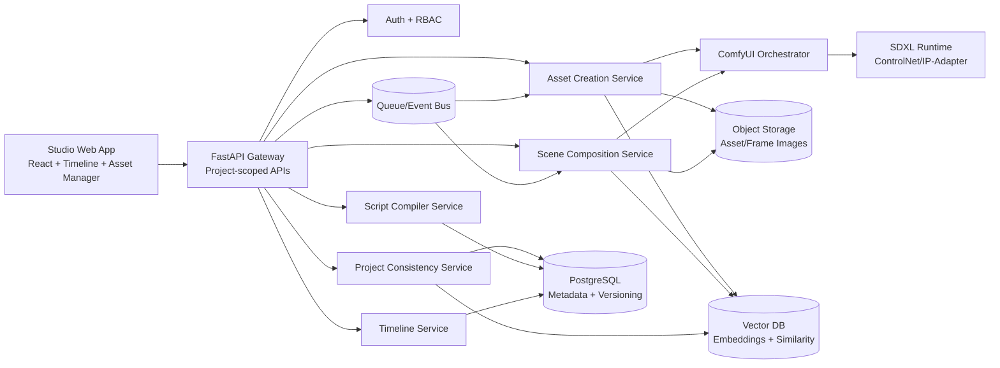

# Project-Oriented Asset-First Storyboard Architecture

## 1) High-Level System Architecture



### Core Architectural Decisions
- **Project is a hard tenancy boundary**: all writes/reads require `project_id`; cross-project joins are forbidden in service layer.
- **Asset-first workflow**: script/scene render jobs are blocked until required assets are in a locked state.
- **Two-pass generation**:
  1. Asset Creation (text/refs → canonical bundles)
  2. Scene Composition (locked bundles + scene graph → storyboard frames)
- **Consistency service as gatekeeper**: validates embedding drift, prompt mutation, style-anchor compliance, and seed inheritance before finalizing frames.
- **Event-driven long-running jobs**: API accepts requests quickly, workers execute async orchestration pipelines.

---

## 2) Project-First Domain Models

### Project
```json
{
  "project_id": "PRJ_001",
  "name": "College Silence",
  "visual_style": "anime cinematic realism",
  "base_model": "SDXL",
  "default_sampler": "DPM++",
  "style_anchor_prompt": "cinematic anime realism, controlled palette, soft contrast",
  "created_at": "2026-02-19T09:00:00Z",
  "status": "active"
}
```

### Asset (canonical envelope)
```json
{
  "asset_id": "CHAR_001",
  "project_id": "PRJ_001",
  "asset_type": "character",
  "name": "Protagonist_A",
  "version": 3,
  "is_locked": true,
  "canonical_prompt": "young male, lean build, sharp jawline, anime cinematic realism",
  "negative_prompt": "extra limbs, identity drift, low detail",
  "seed": 443129,
  "sampler": "DPM++",
  "embedding_refs": {
    "identity": "vec://char_001_identity_v3",
    "face": "vec://char_001_face_v3"
  },
  "images": [
    "s3://storyboard/prj_001/assets/char_001/v3/base/front.png",
    "s3://storyboard/prj_001/assets/char_001/v3/base/three_quarter.png"
  ],
  "metadata": {
    "outfit_variant": "campus_uniform",
    "expression_set": ["neutral", "soft_smile", "angry"]
  }
}
```

### Scene Graph Node
```json
{
  "scene_id": "S03",
  "project_id": "PRJ_001",
  "characters": ["CHAR_001"],
  "environment": "ENV_College_Campus_Morning",
  "nature": ["NAT_TreeLine_Spring"],
  "props": ["PROP_Backpack_Std"],
  "mood": "tense",
  "lighting": "morning diffuse",
  "camera": "wide shot",
  "action": "character walks silently through crowd"
}
```

### Storyboard Timeline Frame
```json
{
  "frame_id": "FR_S03_002",
  "project_id": "PRJ_001",
  "scene_id": "S03",
  "frame_index": 2,
  "render_version": 5,
  "status": "approved",
  "image_uri": "s3://storyboard/prj_001/scenes/S03/frame_002_v5.png",
  "dependencies": {
    "assets": ["CHAR_001@v3", "ENV_009@v1", "PROP_022@v2"],
    "scene_graph_hash": "sha256:..."
  }
}
```

---

## 3) Service Responsibilities

- **Project Service**
  - Create/update project style anchors, model defaults, retention and policy flags.
  - Enforce that every downstream operation includes valid `project_id`.

- **Asset Creation Service**
  - Validate asset-spec JSON/YAML.
  - Run multi-image generation with deterministic seed strategy.
  - Persist bundle + embeddings + metadata + version.
  - Lock/unlock policy transitions.

- **Asset Registry Service**
  - CRUD + version lineage.
  - Search by tags, taxonomy, semantic similarity.
  - Provide composition-ready resolved dependency sets.

- **Script Compiler Service**
  - Convert script text to structured scene graph.
  - Resolve asset placeholders to concrete asset IDs.
  - Reject unresolved scenes before rendering.

- **Scene Composition Service**
  - Accept only scene graph + locked assets.
  - Build ComfyUI graph (ControlNet/IP-Adapter/etc).
  - Produce frame outputs and technical render metadata.

- **Consistency Enforcement Service**
  - Embedding drift threshold checks.
  - Prompt diffing vs canonical prompts/style anchor.
  - Seed inheritance validation + exception audit.

- **Timeline Service**
  - Ordered scene/frame management.
  - Render history, approvals, rollback, export manifests.

---

## 4) Database Schema (Relational + Vector + Object)

### Relational (PostgreSQL)
- `projects(project_id PK, name, visual_style, base_model, default_sampler, style_anchor_prompt, status, created_at)`
- `project_style_anchors(id PK, project_id FK, anchor_type, anchor_value, created_at)`
- `assets(asset_id PK, project_id FK, asset_type, name, version, is_locked, status, tags[], taxonomy jsonb, canonical_prompt, negative_prompt, seed, sampler, metadata jsonb, created_at)`
- `asset_versions(id PK, asset_id FK, version, parent_version, change_note, is_locked, created_at)`
- `asset_images(id PK, asset_id FK, version, image_role, uri, width, height, created_at)`
- `scripts(script_id PK, project_id FK, title, raw_text, compiler_version, created_at)`
- `scenes(scene_id PK, project_id FK, script_id FK, scene_index, mood, lighting, camera, action, graph jsonb, graph_hash, created_at)`
- `scene_asset_refs(id PK, project_id FK, scene_id FK, asset_id FK, required_version, role)`
- `render_jobs(render_job_id PK, project_id FK, scene_id FK, frame_index, status, pipeline_version, submitted_at, completed_at, error)`
- `render_outputs(frame_id PK, project_id FK, scene_id FK, frame_index, render_version, image_uri, metadata jsonb, consistency_report jsonb, created_at)`
- `timeline_entries(id PK, project_id FK, scene_id FK, frame_id FK, order_index, approved_by, approved_at)`

### Vector DB collections
- `asset_identity_embeddings(project_id, asset_id, version, vector, tags)`
- `asset_style_embeddings(project_id, asset_id, version, vector, tags)`
- `render_frame_embeddings(project_id, frame_id, vector, scene_id)`

### Object storage layout
- `/{project_id}/assets/{asset_id}/v{n}/...`
- `/{project_id}/scenes/{scene_id}/frames/v{n}/...`
- `/{project_id}/exports/{timestamp}/...`

---

## 5) API Contracts (FastAPI)

### Project APIs
- `POST /v1/projects`
- `GET /v1/projects/{project_id}`
- `PATCH /v1/projects/{project_id}`

### Asset APIs
- `POST /v1/projects/{project_id}/assets:generate`
  - accepts structured asset spec
  - returns `job_id`
- `POST /v1/projects/{project_id}/assets/{asset_id}:lock`
- `POST /v1/projects/{project_id}/assets/{asset_id}:version`
- `GET /v1/projects/{project_id}/assets/{asset_id}`
- `POST /v1/projects/{project_id}/assets:search`

### Script/Scene APIs
- `POST /v1/projects/{project_id}/scripts`
- `POST /v1/projects/{project_id}/scripts/{script_id}:compile`
- `GET /v1/projects/{project_id}/scenes/{scene_id}`
- `POST /v1/projects/{project_id}/scenes/{scene_id}:validate`

### Rendering APIs
- `POST /v1/projects/{project_id}/scenes/{scene_id}/renders`
- `POST /v1/projects/{project_id}/scenes/{scene_id}/renders/{render_job_id}:rerender`
- `GET /v1/projects/{project_id}/renders/{render_job_id}`

### Timeline/Export APIs
- `GET /v1/projects/{project_id}/timeline`
- `POST /v1/projects/{project_id}/timeline:reorder`
- `POST /v1/projects/{project_id}/exports/pdf`
- `POST /v1/projects/{project_id}/exports/image-sequence`

---

## 6) Scene Rendering Pseudocode

```python
def render_scene_frame(project_id: str, scene_id: str, frame_index: int):
    scene = scene_repo.get(project_id, scene_id)
    assert scene.project_id == project_id

    required_assets = asset_registry.compose_asset_set(project_id, scene_id)
    assert all(asset.is_locked for asset in required_assets)

    consistency_service.validate_scene_inputs(
        project_id=project_id,
        scene=scene,
        assets=required_assets,
    )

    seed_plan = seed_manager.inherit(project_id, scene_id, frame_index)

    comfy_graph = comfy_builder.build_scene_graph(
        project_style=project_repo.get_style_anchor(project_id),
        environment_asset=required_assets.environment,
        character_assets=required_assets.characters,
        nature_assets=required_assets.nature,
        prop_assets=required_assets.props,
        camera=scene.camera,
        lighting=scene.lighting,
        action=scene.action,
        seed_plan=seed_plan,
    )

    render_result = comfy_orchestrator.execute(comfy_graph)

    report = consistency_service.post_render_checks(
        project_id=project_id,
        scene=scene,
        render_image=render_result.image,
        expected_assets=required_assets,
    )

    if not report.pass_all:
        raise ConsistencyViolation(report)

    frame = timeline_repo.store_frame(
        project_id=project_id,
        scene_id=scene_id,
        frame_index=frame_index,
        image=render_result.image,
        metadata=render_result.metadata,
        consistency_report=report,
    )

    return frame
```

---

## 7) ComfyUI Node Orchestration Strategy

### Asset generation workflow templates
- **Character template**
  - Text Encode (canonical + negative)
  - SDXL base model load
  - Face ID/IP-Adapter identity conditioning
  - Pose preset conditioning (optional)
  - KSampler with fixed seed bank
  - Multi-angle/multi-expression branch outputs
- **Environment/Nature/Prop template**
  - Style anchor prompt prepend
  - ControlNet depth/lineart for structure retention
  - Variant branches by time/weather/season

### Scene composition workflow
1. Load base model + project LoRA/style adapters.
2. Encode scene metadata prompt from structured graph fields only.
3. IP-Adapter for each character identity reference.
4. ControlNet stack:
   - OpenPose (character pose)
   - Depth (layout consistency)
   - Canny/Lineart (architectural integrity)
5. Regional attention masking for foreground/background and per-character zones.
6. Lighting harmonization node and color script post-node.
7. KSampler using inherited seed policy.
8. Output + optional super-resolution pass.
9. Embedding extraction node for drift validation.

### Orchestration standards
- Version every graph as `pipeline_version`.
- Keep workflow JSON immutable per version; no hidden prompt mutation.
- Store full node graph hash with render metadata for reproducibility.

---

## 8) Scalability & Future-Proofing

- **Multi-tenant scale**
  - Partition by `project_id` (DB indexes, object prefixes, vector namespaces).
  - Queue isolation for enterprise projects.

- **Performance**
  - Async workers with GPU affinity scheduling.
  - Cache hot embeddings and style adapters in memory.
  - Precompute scene composition plans before render dispatch.

- **Reliability**
  - Idempotent job submission via client request IDs.
  - Dead-letter queue for failed render jobs.
  - Automatic retry with backoff for transient GPU failures.

- **Governance and auditability**
  - Persist prompt diffs, seed lineage, and lock transitions.
  - Add immutable event log for compliance and studio review.

- **Evolution path**
  - Add shot continuity solver for camera path consistency.
  - Add animation keyframe handoff exports (AE/Blender).
  - Support model abstraction layer (SDXL, Flux, custom finetunes) without API change.
